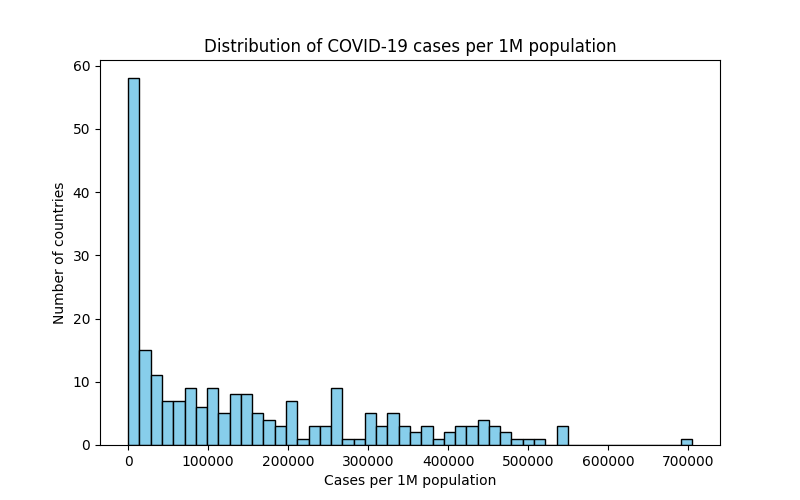
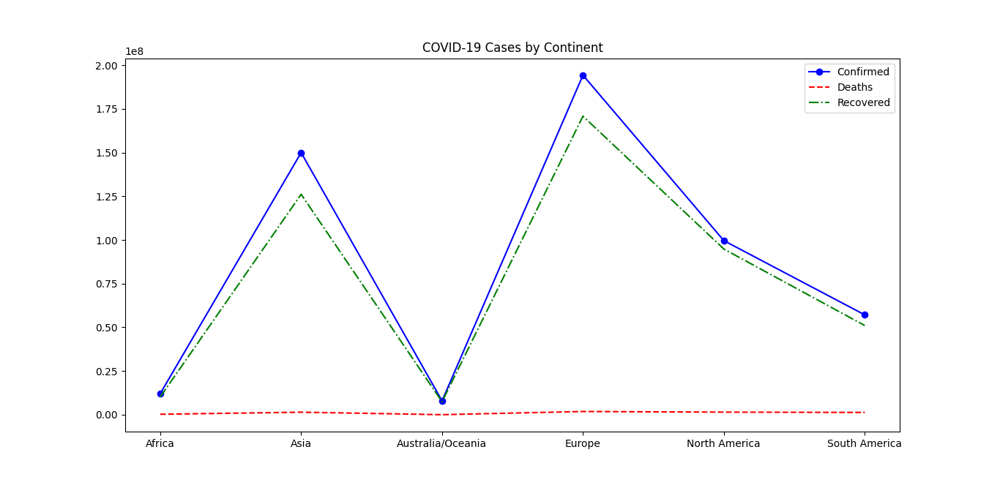

# 🦠 COVID-19 Data Visualization Project

A **Python-based** data visualization project to analyze and explore the global impact of COVID-19 using real-world data.

## 📌 Project Overview

This project leverages COVID-19 data from `worldometer_coronavirus_summary_data.csv` to create insightful visualizations using **Matplotlib**, **Pandas**, and **NumPy**. The visualizations include:

- 📈 **Line Charts**: Confirmed cases, deaths, and recoveries by continent  
- 📊 **Multiple Subplots**: Side-by-side comparisons of key metrics  
- 📉 **Histogram**: Distribution of cases per 1M population  
- ⚪ **Scatter Plot**: Relationship between tests conducted and confirmed cases  
- 📅 **Bar Charts**: Custom ticks and labels for clear insights  
- 🎨 **Enhanced Formatting**: Legends, spacing, and layout optimization  

## 🛠️ Technologies Used

| Tool/Library        | Purpose                          |
|---------------------|----------------------------------|
| **Python 3**        | Core programming language        |
| **Pandas**          | Data loading and manipulation    |
| **Matplotlib**      | Data visualization               |
| **NumPy**           | Numerical operations             |

## 📂 Project Structure


```
covid-19-visualization/
├── covid_analysis.py # Main script containing all visualizations
├── worldometer_coronavirus_summary_data.csv # Dataset
├── README.md # Project description and instructions
├── line plot.png # Sample visualization
├── Adjusting subplot spacing.png # Sample visualization
├── Figures & Subplots.png # Sample visualization
├── Histogram.png # Sample visualization
├── Legends.png # Sample visualization
├── Scatter Plot.png # Sample visualization
└── Ticks & Labels.png # Sample visualization
```


## ▶️ How to Run

1. Ensure the `worldometer_coronavirus_summary_data.csv` file is in the same directory as `covid_analysis.py`.  
2. Install the required libraries using:
   ```bash
   pip install pandas matplotlib numpy
3. Execute the script with:
python covid_analysis.py
4. Visualizations will appear automatically in a new window.   

## 📝 Code Snippet

Here’s a simple example of how the visualizations are generated:

```python
import pandas as pd
import matplotlib.pyplot as plt

data = pd.read_csv('worldometer_coronavirus_summary_data.csv')
plt.plot(data['Confirmed'], label='Confirmed Cases')
plt.legend()
plt.show()


### 📈 Sample Output

**Line Plot:**


**Adjusting Subplot Spacing:**


**Figures & Subplots:**


**Histogram:**


**Legends:**


**Scatter Plot:**


**Ticks & Labels:**


## 🚀 Future Improvements

- 🖼️ Add interactive dashboards using **Plotly** or **Streamlit**  
- 📄 Export visualizations as PNG or PDF files  
- 🔄 Automate daily data updates from online sources  

## 🤝 Connect With Me

If you enjoy this project, please ⭐ star it on GitHub and follow my journey!

- **GitHub**: [Abdelmoniem-saied](https://github.com/Abdelmoniem-saied)  
- **Phone/WhatsApp**: +20 128 526 7285  
- **Email**: [10112022105914@stud.cu.edu.eg](mailto:10112022105914@stud.cu.edu.eg)  

---

⭐ **Thank you for exploring my project!** Feel free to share your feedback or suggestions!


